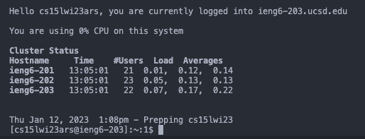
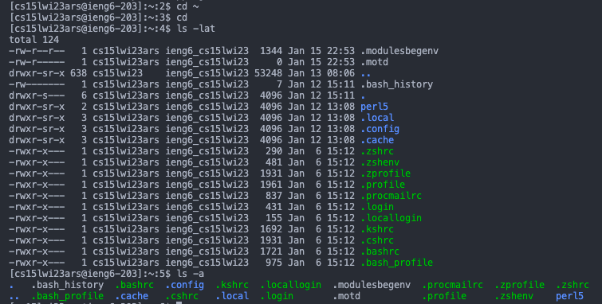

# Lab Report 1

## 1. Installing VScode
To log in on your course-specific account on ieng6, you'll first install [Visual Studio Code](https://code.visualstudio.com/). Follow the steps on the website and when you open VScode, it should look like this: 

## 2. Remotely Connecting
For Window users, install [Git for Windows](https://gitforwindows.org/). After installing Git, use this [website](https://stackoverflow.com/a/50527994) to set your default terminal to git bash.

Open a terminal on VScode by going to the menu option and press Terminal, then New Terminal.
Type `$ ssh cs15lwi23zz@ieng6.ucsd.edu` to the terminal, replacing *zz* with the letters in your course-specific account. Then you'll need to allow connection and enter your password. Your terminal should display this: 

## 3. Trying Some Commands
Now that you are connected, try entering some commands to the terminal. Some commands you can try are:
* cd ~
* cd
* ls -lat
* ls -a 

Your screen should look something like this: 

