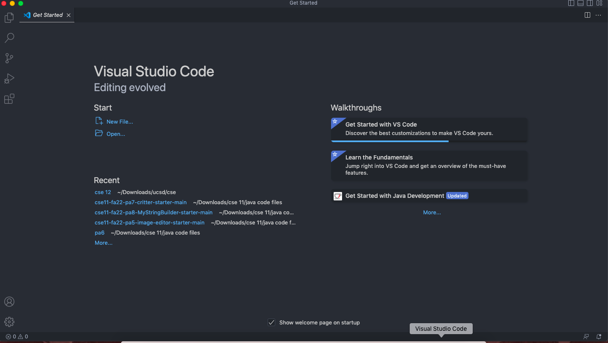

# Lab Report 1

## 1. Installing VScode
To log in on your account on ieng6, you'll first install [Visual Studio Code](https://code.visualstudio.com/). Follow the steps on the website and when you open VScode, it should look like this: 

## 2. Remotely Connecting
For Window users, 
