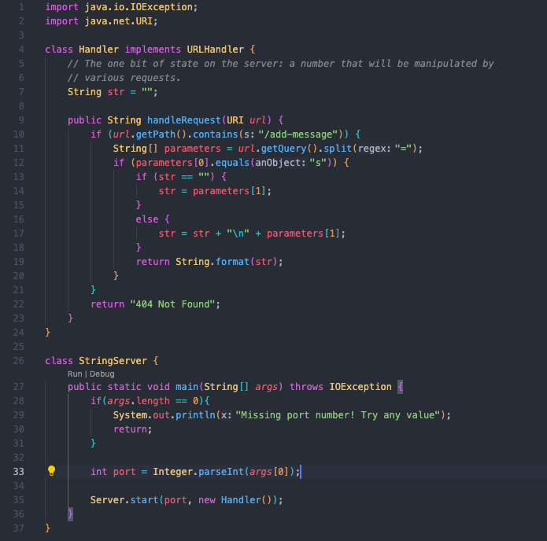

# Lab Report 2

## Part 1
Code for my StringServer:




The main method and handlerRequest method was called. The relevant arguments in those methods are "/add-message", "=", and "s". The values of any
relevant fields of the class is the String variable str. The str variable changed to "hey" after adding "hey". 


The main method and handlerRequest method was called. The relevant arguments in those methods are "/add-message", "=", and "s". The values of any
relevant fields of the class is the String variable str. The str variable changed to "hey" + "\n" + "hello" after adding "hello".


## Part 2
A failure-inducing input:
```
  @Test
  public void testReversed() {
    int[] input1 = {1,2,3};
    assertArrayEquals(new int[]{3,2,1}, ArrayExamples.reversed(input1));
  }
```

The symptom is {0,0,0}


An input that doesn’t induce a failure:
```
  @Test
  public void testReversed() {
    int[] input1 = {0};
    assertArrayEquals(new int[]{0}, ArrayExamples.reversed(input1));
  }
```


Before code change:
```
  static int[] reversed(int[] arr) {
    int[] newArray = new int[arr.length];
    for(int i = 0; i < arr.length; i += 1) {
      arr[i] = newArray[arr.length - i - 1];
    }
    return arr;
  }
```

After code change:
```
 static int[] reversed(int[] arr){
      int[] newArray = new int[arr.length];
      for (int i = 0; i < arr.length; i++){
        newArray[i] = arr[arr.length - i -1];
      }
      return newArray;
    }
```

## Part 3
In lab 3, I learned that some tests can pass even when there are still bugs in the code.
Therefore, I need to create more tests that test many different cases to make sure my code does not contain any bugs.
