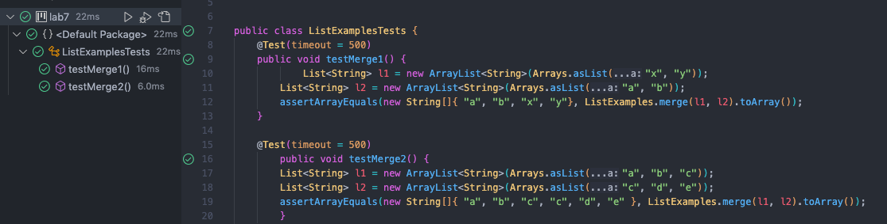
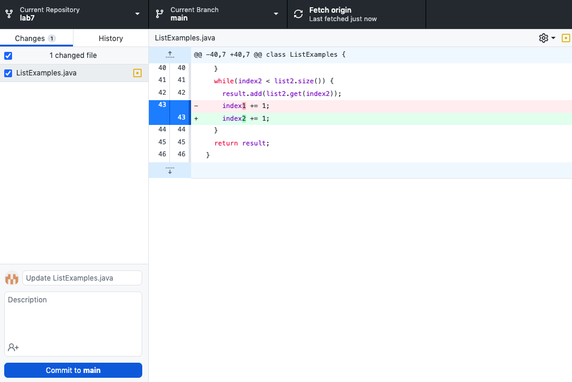
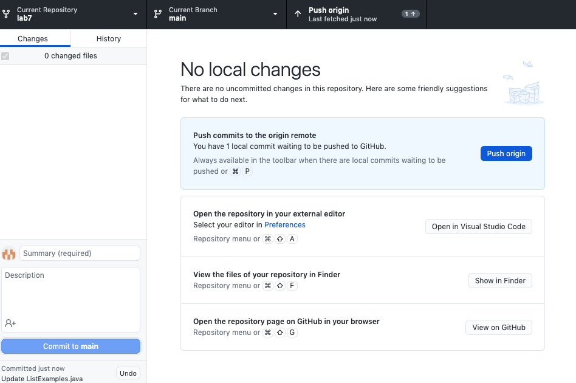

# Lab Report 4

##### 4. Log into ieng6
I typed `ssh cs15lwi23ars@ieng6.ucsd.edu` to log into my account.

##### 5. Clone your fork of the repository from your Github account
I typed `git clone https://github.com/kellylaaa/lab7.git`

##### 6. Run the tests, demonstrating that they fail
I typed `cd lab7` then pressed: `<up><up><up><up><up><enter>`, `<up><up><up><up><up><enter>`

The `javac -cp .:lib/hamcrest-core-1.3.jar:lib/junit-4.13.2.jar *.java` command was 5 up in the search history so to access it I pressed the up arrow 5 times. Then the `java -cp .:lib/hamcrest-core-1.3.jar:lib/junit-4.13.2.jar org.junit.runner.JUnitCore ListExamplesTests` command was 5 up in the search history so to access it I pressed the up arrow 5 times.

##### 7. Edit the code file to fix the failing test
I changed line 43 from `index1 += 1;` to `index2 += 1;`

##### 8. Run the tests, demonstrating that they now succeed
To run the tests again, I pressed `<up><enter>`, `<up><enter>`. Doing so accessed `javac -cp .:lib/hamcrest-core-1.3.jar:lib/junit-4.13.2.jar *.java` since
it was 1 up in the search history and then to access `java -cp .:lib/hamcrest-core-1.3.jar:lib/junit-4.13.2.jar org.junit.runner.JUnitCore ListExamplesTests`, I did the same.

##### 9. Commit and push the resulting change to your Github account
I pressed "commit to main" on GitHub Desktop then pressed "push origin" to change the code on my Github account.

