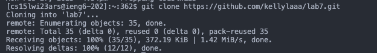
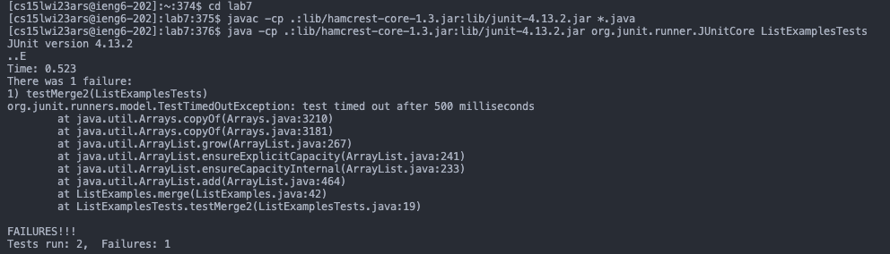
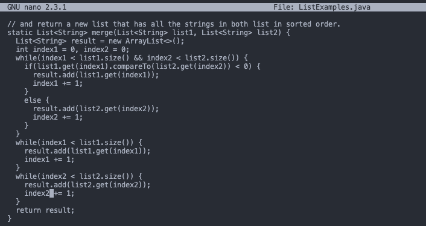
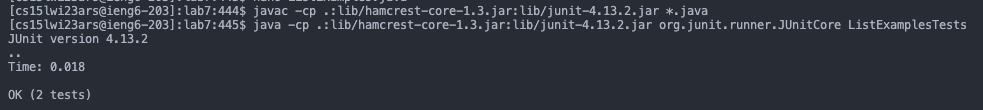
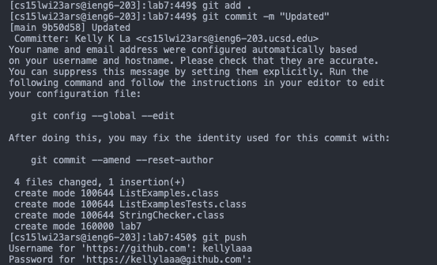

# Lab Report 4

##### 4. Log into ieng6
I typed `ssh cs15lwi23ars@ieng6.ucsd.edu` to log into my account.

##### 5. Clone your fork of the repository from your Github account
I typed `git clone https://github.com/kellylaaa/lab7.git`

##### 6. Run the tests, demonstrating that they fail
I typed `cd lab7` then pressed: `<up><up><up><up><up><enter>`, `<up><up><up><up><up><enter>`

The `javac -cp .:lib/hamcrest-core-1.3.jar:lib/junit-4.13.2.jar *.java` command was 5 up in the search history so to access it I pressed the up arrow 5
times. Then the `java -cp .:lib/hamcrest-core-1.3.jar:lib/junit-4.13.2.jar org.junit.runner.JUnitCore ListExamplesTests` command was 5 up in the search history so to access it I pressed the up arrow 5 times.

##### 7. Edit the code file to fix the failing test
I typed `nano ListExamples.java` then held on to the <down> key until I found the line to fix. Pressed <right>, then <backspace> to delete "1" and pressed `<2>`. To save I pressed `<ctrl+o>`, and to exit I pressed `<ctrl+x>`

##### 8. Run the tests, demonstrating that they now succeed
To run the tests again, I pressed `<ctrl+r>`, typed `<javac>`. Doing so accessed `javac -cp .:lib/hamcrest-core-1.3.jar:lib/junit-4.13.2.jar *.java` and
  then to access `java -cp .:lib/hamcrest-core-1.3.jar:lib/junit-4.13.2.jar org.junit.runner.JUnitCore ListExamplesTests`, I pressed `<ctrl+r>` and typed `<java>`.

##### 9. Commit and push the resulting change to your Github account
I typed `git add .` then `git commit -m "Update"` to commit the changes. Then I typed `git push` to push the changes to Github

