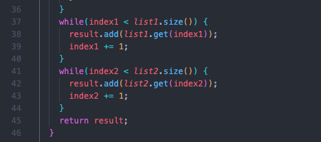

# Lab Report 4

##### 4. Log into ieng6
I typed ieng6 login.

##### 5. Clone your fork of the repository from your Github account
I typed git clone and pressed: `Command-V` 

##### 6. Run the tests, demonstrating that they fail
Keys pressed: `<up><up><up><up><up><enter>`, `<up><up><up><up><up><enter>`

The `javac -cp .:lib/hamcrest-core-1.3.jar:lib/junit-4.13.2.jar *.java` command was 5 up in the search history so to access it I pressed the up arrow 5 times. Then the `java -cp .:lib/hamcrest-core-1.3.jar:lib/junit-4.13.2.jar org.junit.runner.JUnitCore ListExamplesTests` command was 5 up in the search history so to access it I pressed the up arrow 5 times.

##### 7. Edit the code file to fix the failing test

##### 8. Run the tests, demonstrating that they now succeed

##### 9. Commit and push the resulting change to your Github account
