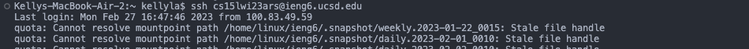

# Lab Report 4

##### 4. Log into ieng6

##### 5. Clone your fork of the repository from your Github account

##### 6. Run the tests, demonstrating that they fail

##### 7. Edit the code file to fix the failing test

##### 8. Run the tests, demonstrating that they now succeed

##### 9. Commit and push the resulting change to your Github account
